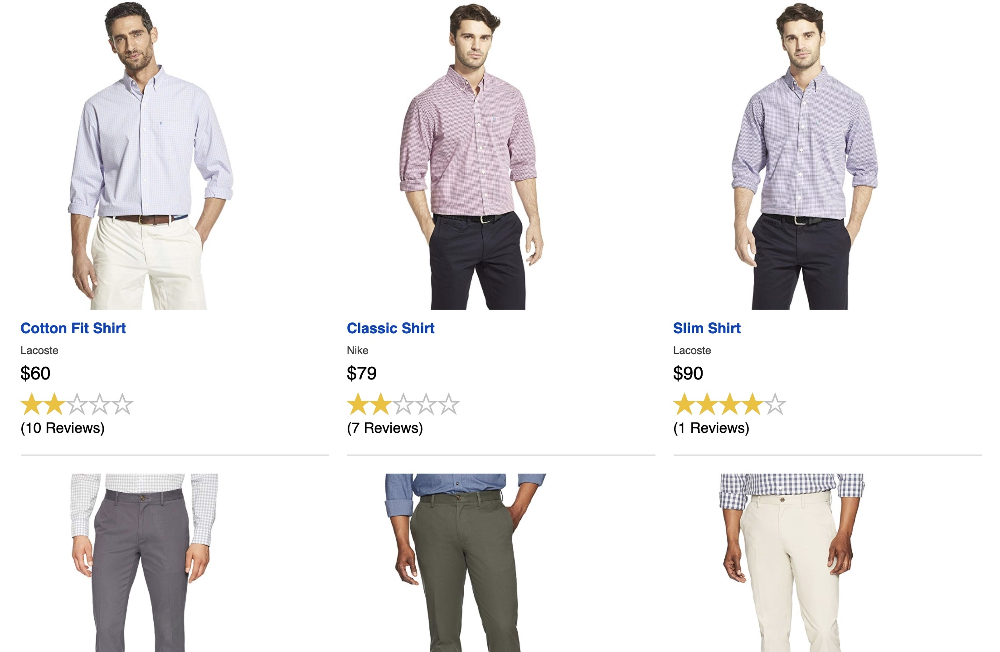
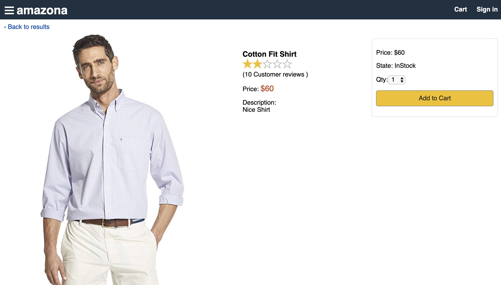
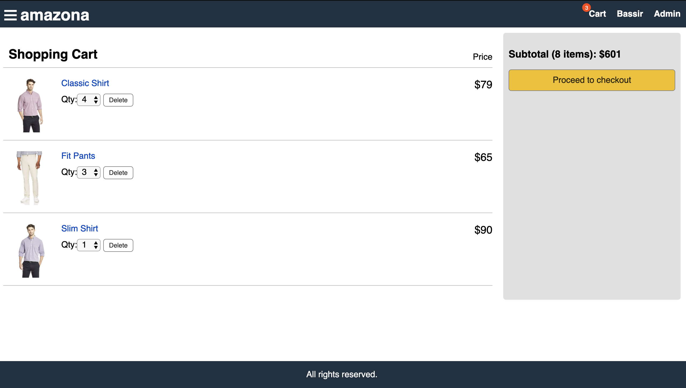
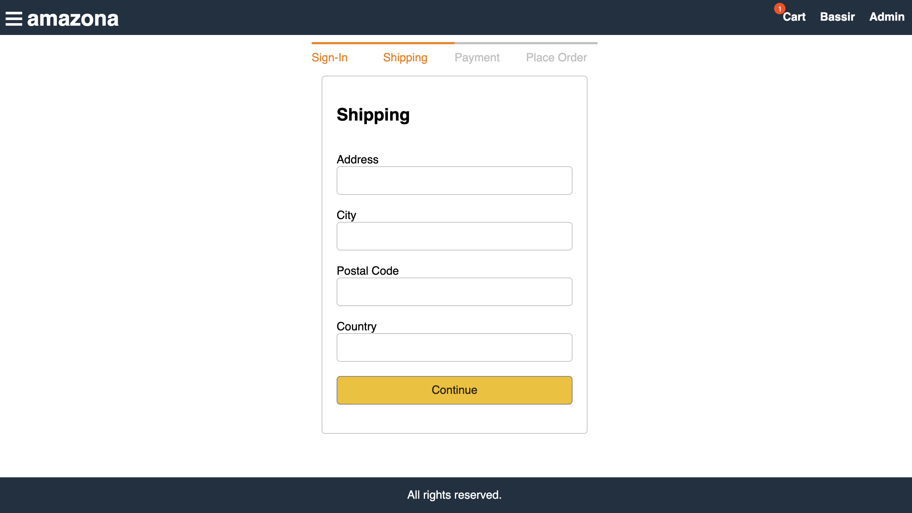
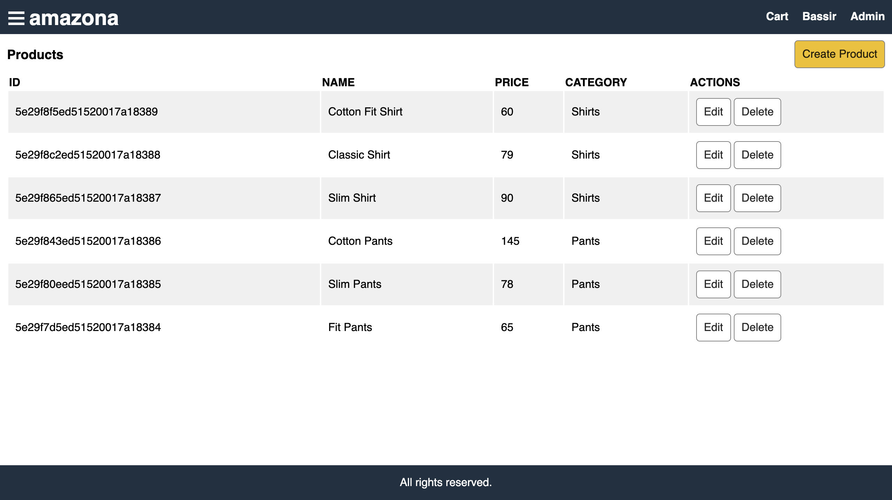

# Apna Shop – Full-Stack E-Commerce Website

Welcome to **Apna Shop** — a modern, full-stack e-commerce web application that I built using **React**, **Node.js**, **Express**, and **MongoDB**.  
This project was created by me (**Keshav Kabra**) as a clean, feature-rich online store, inspired by real-world e-commerce workflows.

---

## Features

My application includes:

- **Frontend**: React with Hooks, React Router, Axios for API calls
- **State Management**: Redux for predictable state handling
- **Backend**: Node.js & Express REST API with JWT authentication and file uploads
- **Database**: MongoDB with Mongoose ODM
- **Styling**: HTML5, CSS3, Flexbox, CSS Grid
- **Development Tools**: ESLint, Babel, Git
- **Deployment Ready**: Configured for platforms like Heroku

---

## How to Run My Project Locally

### 1. Clone my repository
\`\`\`bash
git clone https://github.com/Keshavkabra7/Apna-shop.git
cd Apna-shop
\`\`\`

### 2. Install & Configure MongoDB

To store and manage application data, my project uses **MongoDB** — a fast, NoSQL document database.

#### Installation
- Download MongoDB Community Edition from the official documentation:  
  [📄 MongoDB Installation Guide](https://docs.mongodb.com/manual/administration/install-community/)
- Follow the installation steps for your operating system (Windows, macOS, or Linux).

### 3. Start the Backend
\`\`\`bash
npm install
npm start
\`\`\`

### 4. Start the Frontend
\`\`\`bash
# In a new terminal
cd frontend
npm install
npm start
\`\`\`

### 5. Create an Admin User
Visit: `http://localhost:5000/api/users/createadmin`

This will return an admin email and password for login.

### 6. Sign In
Go to: `http://localhost:3000/signin`

Log in using the admin credentials.

### 7. Add Products
Navigate to: `http://localhost:3000/products`

Click **Create Product** and fill in the details.

---

## My Application Screenshots

### Home Page
I designed this to display a list of available products.

### Product Details Page
I created this page to show information about the selected product, including reviews.

### Shopping Cart
I built a fully functional cart system with quantity updates and removal options.

### Checkout Process
I implemented a guided checkout flow including shipping, payment, and order confirmation.

### Admin Product Management
I created an admin panel where I can create, edit, and delete products.

---

## Extra Features I Implemented

- **Product Ratings & Reviews**
- **Local and AWS S3 Image Uploads**
- **Order Management (for Admin)**
- **User Profile & Order History**
- **Product Filtering & Sorting**
- **JWT-secured Authentication**

---

## Summary

This project demonstrates my ability to create a full-fledged e-commerce application with a React frontend and a Node.js + Express backend connected to MongoDB. I designed it to be a strong portfolio piece that showcases my full-stack development skills and is adaptable for real-world deployment.

---

## Tech Stack I Used

- **Frontend**: React, Redux, React Router, Axios
- **Backend**: Node.js, Express.js
- **Database**: MongoDB with Mongoose
- **Authentication**: JWT (JSON Web Tokens)
- **Styling**: CSS3, Flexbox, CSS Grid
- **Development**: ESLint, Babel, Git

## Contributing to My Project

1. Fork my repository
2. Create your feature branch (`git checkout -b feature/AmazingFeature`)
3. Commit your changes (`git commit -m 'Add some AmazingFeature'`)
4. Push to the branch (`git push origin feature/AmazingFeature`)
5. Open a Pull Request

## License

My project is licensed under the MIT License - see the [LICENSE](LICENSE) file for details.
